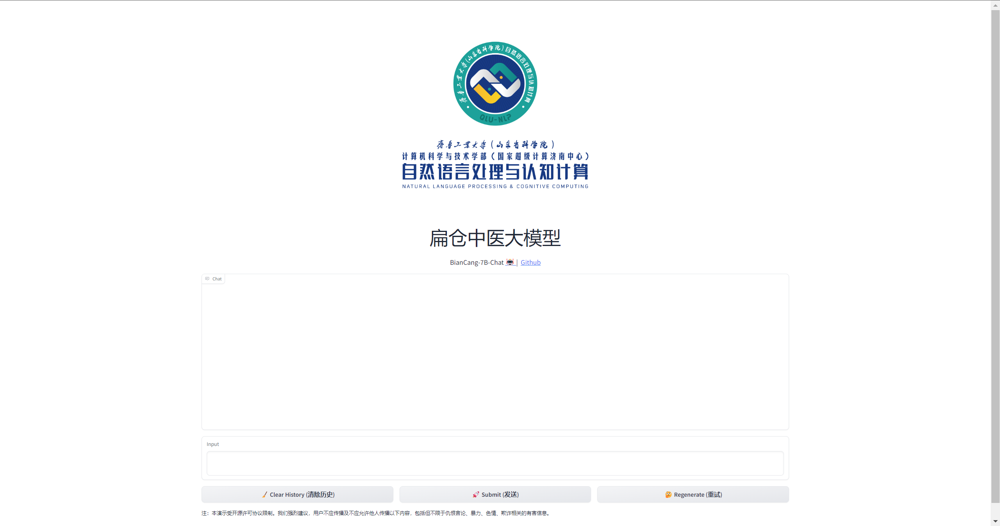

# 扁仓中医大模型

扁仓中医大模型(BianCang-TCM-LLM)开源仓库。


<p algin="left">
    
</p>


为推动大语言模型在传统中医领域的发展，提升大语言模型的中医知识水平，帮助中医医生进行辅助诊断，同时推动大模型赋能中医传承，我们将在该仓库推出**扁仓**系列中医大模型。

- 扁仓中医大模型:
  - 扁仓中医大模型的训练数据包含两部分：1. [中医药指令数据集](https://huggingface.co/datasets/michaelwzhu/ShenNong_TCM_Dataset) 2. 由心内科真实患者病历构建的中医辅助诊断数据集（将在未来开源）。
  - 扁仓中医大模型以Qwen-7B-Chat为底座，采用全参微调得到。

## 更新

2024/01/11 🚀 开源[BianCang-7B-Chat](https://huggingface.co/QLU-NLP/BianCang-7B-Chat)模型权重。

## 快速使用

环境要求：

* python 3.8及以上版本
* pytorch 1.12及以上版本，推荐2.0及以上版本
* transformers 4.32及以上版本
* 建议使用CUDA 11.4及以上（GPU用户、flash-attention用户等需考虑此选项）


1.[下载](https://huggingface.co/QLU-NLP/BianCang-7B-Chat)扁仓模型权重

2.将代码仓库克隆到本地

```bash
git clone 
pip install -r requirements.txt
```

3.使用交互式Demo进行部署推理：

找到仓库目录下的cli_demo.py文件，将代码中的模型路径替换为扁仓模型权重所在路径，然后运行如下命令：

```shell
python cli_demo.py
```

4.使用Web UI进行部署推理

首先在仓库目录下运行以下命令以安装Web UI所需的代码库：

```
pip install -r requirements_web_demo.txt
```

然后找到仓库目录下的web_demo.py文件，将代码中的模型路径替换为扁仓模型权重所在路径，然后运行如下命令随后运行如下命令，并点击生成链接：

```shell
python web_demo.py
```


我们提供了一个在线的体验页面：http://10.19.4.9/ 

<div class="container" style="text-align: center;">
  
</div>

由于GPU和网络资源的限制，该页面目前只能通过齐鲁工业大学（山东省科学院）校园网进行访问。


## 效果对比

<table align="center">
    <tr align="center" valign="center">
        <th>问诊问题</th>
        <th>Qwen-7B-Chat</th>
        <th>BianCang-7B-Chat</th>
    </tr>
    <tr align="top" valign="top">
        <td>患者阵发性胸闷、后背胀痛2年，加重5天余。入院症见间断性胸闷、后背胀痛，偶有心慌、乏力，无头晕、恶心，无咳嗽、咳痰，无乏力，无腹痛、腹胀，纳眠可，二便调。<br/>从中医望闻切诊的角度看，该患者表情自然，面色少华，形体正常,动静姿态，语气清,气息平；无异常气味,舌淡，苔薄白，脉弦细。<br/>请你从中医的角度判断该患者最有可能患的疾病，并给出疾病对应的中医证型。</td>
        <td>根据患者的症状和中医诊断方法，患者可能患有气滞血瘀证。<br/>中医认为，气滞血瘀证是由于气机郁滞，血液运行不畅，导致胸胁胀痛、疼痛固定不移，舌紫暗或有瘀斑，脉涩等症状。而患者的表现如胸闷、后背胀痛，面色少华等都符合气滞血瘀的症状。<br/>因此，针对这种病症，中医治疗主要以活血化瘀为主，可以选用行气活血药，如柴胡、枳壳、川芎、丹参等进行调理。同时，配合食疗也可以帮助改善病情，如食用一些具有活血化瘀作用的食物，如黑木耳、山楂、红枣等。</td>
        <td>根据中医的角度，根据该患者的入院情况，最有可能的疾病是胸痹心痛病。下面给出该疾病对应的中医证型分析：<br/>中医证型：气虚血瘀证。气虚血瘀证是指机体脏腑功能衰退，元气不足，无力推动血液运行，致血流不畅而成瘀所产生的一系列临床表现的证候，多因久病体虚，劳累过度，年老体衰所致。常见于胸痹、中风、积聚、痹证等疾病中。<br/>该证型的典型症状为：心悸气短，纳少乏力，少气懒言，面色淡白或暗滞，或中隐痛，或腹中胀满作痛，或有积块，或为偏瘫，舌青紫，或有瘀斑、瘀点，脉细缓而涩<br/>该证型的常见疾病有: <br/>1、胸痹<br/>在胸痹中出现气虚血瘀证表现为胸闷隐痛，且位置固定不移，时作时止，心悸气短，倦怠懒言，遇劳更甚，舌淡暗或有瘀斑。治宜益气养心、活血通络，方用人参汤（《金匮要略》）合血府逐瘀汤(《医林改错》）。<br/>2、中风<br/>以半身不遂，口舌喎斜，言语謇涩或不语，遍身麻木，面色恍白，气短乏力，口角流涎，自汗出，心悸便溏，手足肿胀，舌质暗淡，舌苔薄白或白腻，脉沉细，细缓或细弦等为特点。治宜益气活血、通经活络，方用补阳还五汤（《医林改错》）。<br/>3、积聚<br/>表现为积块坚硬，疼痛固定不移，且逐渐加剧，面色萎黄或黧黑，形体消瘦，纳食减少，乏力懒言，舌质淡紫，或边见瘀斑，舌苔白，脉细涩等。治宜补益气血、活血化瘀，方用八珍汤（《证体类要》）和化积丸（《杂病源流犀浊》）。<br/>4、痹证<br/>其特点为关节肿大，甚至强直畸形，屈伸不利，关节久痛不愈或疼痛时轻时重，乏力自汗，气短懒言，舌质紫，舌苔薄白，脉细涩等。治宜益气活血、祛痰通络，方用黄芪桂枝五物汤（《金匮要略》）合桃红饮（《类证治裁》）。<br/>综上所述，该患者最有可能患有气虚血瘀证的胸痹心痛病。请注意，这只是基于中医角度的初步判断，仅供参考。为了确诊和制定治疗方案，建议患者咨询中医专业医生进行详细的诊断和治疗。</td>
    </tr>
    <tr align="top" valign="top">
    <td>下面是一位患者的入院情况：患者因“突发左下肢疼痛肿胀10小时”入院。入院症见言语不清，左下肢疼痛肿胀，胸闷、胸痛，无头晕头痛，纳眠可，二便调。查体体温36.5℃脉搏75次/分呼吸18次/分血压129/97mmHgVTE评分8分高危，卒中风险高危。双肺呼吸音清晰，未闻及干、湿罗音，未闻及胸膜摩擦音。心界不大，心率75次/分，心律齐整，心音有力，各瓣膜听诊区未闻及杂音，未闻及心包摩擦音。脊柱生理弯曲存在，左下肢屈曲、短缩、外旋畸形，左大腿肿胀，大粗隆处压痛（+），纵轴叩击痛（+），肢端血运及活动可。\n从中医望闻切诊的角度看，该患者表情痛苦，面色萎黄，形体偏瘦，静止状态，言语不利，气息弱；无异常气味，舌淡红，苔薄白，舌下络脉瘀紫，脉弦。\n请你从中医的角度判断该患者最有可能患的疾病，并给出疾病对应的中医证型。</td>
    <td>根据患者的症状和体征，结合中医理论，该患者可能患有"气滞血瘀"证型的病证。<br/>具体来说，患者的肢体疼痛、肿胀等症状可能是由于气血运行不畅，经络阻塞所致。而患者的面色萎黄、形体偏瘦、言语不利、气息弱等则是由于气虚血瘀，气血两亏的表现。舌淡红、苔薄白、舌下络脉瘀紫、脉弦则进一步证实了这一点。<br/>因此，综合上述情况，该患者可能患有气滞血瘀证型的疾病，需要进行相应的中药治疗以调理气血，活血化瘀。</td>
    <td>根据中医的角度，根据该患者的入院情况，最有可能的疾病是股骨骨折。下面给出该疾病对应的中医证型分析：<br/>中医证型：气滞血瘀证。气滞血瘀证，中医病证词，指气滞与血瘀同时存在的病理状态。一般多先由人体气的运行不通畅，然后引起血液的运行瘀滞。多与情志刺激、饮食失节、年老久病有关。表现为胸胁胀闷，走窜疼痛或有明显刺痛，痛处固定且不可碰触，碰触时疼痛加重，或有坚硬肿块，局部青紫肿胀。常见于现代医学高血压、高脂血症、冠心病、心肌梗死、脑淤血、皮下肿块、静脉曲张、胃溃疡、肠梗阻、多种肿瘤、子宫出血、排卵障碍等多种疾病。<br/>综上所述，该患者最有可能患有气滞血瘀证的股骨骨折。请注意，这只是基于中医角度的初步判断，仅供参考。为了确诊和制定治疗方案，建议患者咨询中医专业医生进行详细的诊断和治疗。</td>
</tr>
<tr align="top" valign="top">
    <td>患者阵发性胸闷、憋气6年，加重3天入院。入院症见胸闷、憋气，双下肢明显乏力，体力活动明显受限，双手震颤，乏力、气短，吞咽困难，饮水呛咳，口干口渴，头晕、头痛，无明显心前区疼痛，无恶心、呕吐，恶热，无咳嗽、咳痰，大小便正常，睡眠差，入睡困难，易醒。<br/>从中医望闻切诊的角度看，该患者表情痛苦，面色红润，形体正常,语气清,气息平；无异常气味,舌淡暗、苔白厚,脉结代。<br/>请你从中医的角度判断该患者最有可能患的疾病，并给出疾病对应的中医证型。</td>
    <td>根据患者的症状和中医辨证原则，该患者最可能患有"肺肾阴虚证"。这种病症的常见表现有胸闷、憋气、四肢无力、出汗过多等。中医认为，"肺主呼吸，肾主纳气"，因此当肺、肾功能虚弱时，会导致胸闷、憋气等症状。此外，由于肺肾两脏互为表里关系，所以此病还会伴有口干口渴、头晕、头痛等症状。综合分析，患者的表现符合肺肾阴虚证的特点，故可诊断为肺肾阴虚证。</td>
    <td>根据中医的角度，根据该患者的入院情况，最有可能的疾病是心水。下面给出该疾病对应的中医证型分析：<br/>中医证型：阳虚水泛证。阳虚水泛证是指阳气亏损，不能温运、气化水液，以肢体浮肿，小便不利，心悸喘促，腹胀濡泄，形寒肢冷，舌淡胖，苔白滑为常见症的证候。常见于心悸怔忡、水肿等疾病中。<br/>该证型的典型症状为：水肿下肢为重，起病缓慢，重者肿至全身，小便不利，面色晄白或灰滞，常伴有胸脘痞闷，纳呆便溏，神倦肢冷，舌淡胖有齿痕，脉沉细。<br/>该证型的常见疾病有: <br/>1、心悸怔忡<br/>病人出现心悸不安，少气乏力，口唇青紫，颈部青筋暴露，下肢浮肿，但坐不得卧，卧则心悸气短加重，此乃病变累及心阳，心阳虚衰，心功能下降，水湿内停，血液瘀阻所致，治当温阳利水，养心安神，方用苓桂术甘汤（《伤寒论》）加减。<br/>2、水肿<br/>大凡水肿，多责之于脾肾。因脾主运化水湿，肾主温化水液，脾肾阳虚，水湿不化，不得从二便排出，则泛滥于肌肤，出现水肿。多以健脾、温肾利水为主，所谓“土能治水”，脾气得实，则清气得升，浊气得降，水气自行。在以脾阳虚为主的水肿病中，可见全身浮肿，小便短少，身体困重，胸闷腹，纳呆恶心，苔白腻，脉沉细等症。此由于久居湿地，或冒雨涉水，或过食生冷，损伤脾阳，牌失健运，水湿内停，泛滥肌肤所致。治宜健脾化湿，通阳利水，方用五苓散（《伤寒论》）合五皮饮（《和剂局方》）。在以肾阳虚为主的水肿病中，可见全身浮肿，腰以下为重，按之凹陷，畏寒肢冷，腹胀便溏，倦怠乏力，舌淡有齿痕，脉沉缓等。此由于久病伤肾，肾阳不足，气化无权，水邪泛滥所致。治宜温肾助阳，化气行水。方用真武汤（《伤寒论》）加减。<br/>综上所述，该患者最有可能患有阳虚水泛证的心水。请注意，这只是基于中医角度的初步判断，仅供参考。为了确诊和制定治疗方案，建议患者咨询中医专业医生进行详细的诊断和治疗。</td>
</tr>
</table>


## 致谢

本项目基于开源项目进行开发，在此对相关项目和研究开发人员表示感谢。

- [Qwen](https://github.com/QwenLM/Qwen)
- [SWIFT](https://github.com/modelscope/swift)
- [ShenNong-TCM-LLM](https://github.com/michael-wzhu/ShenNong-TCM-LLM)

## 团队

本项目由齐鲁工业大学（山东省科学院）自然语言处理与认知计算团队维护，如果您有需要，可以通过以下邮箱与我们取得联系：nlp@qlu.edu.cn

<p align="center">
  
</p>
  


课题组公众号：
<p align="center">
  
</p>>


## 免责声明

- 本项目相关资源仅供学术研究之用。
- 扁仓中医大模型作为基于语言模型的智能助手，其不能代替中医/西医进行医学诊断和给出医学建议。如有需要，请咨询专业医生或前往医院就诊。
- 扁仓系列中医大模型将在未来快速迭代，当前版本为较初始版本，我们将会不断进行改进和更新。

## 引用

如果你使用了本项目的模型，数据或者代码，请声明引用：

```bash
@misc{,
      title={BianCang: A Traditional Chinese Medicine Large Language Model}, 
      author={Sibo Wei, Wenpeng Lu, Jianlei Wang},
      year={2024},
      publisher = {GitHub},
      journal = {GitHub repository},
      howpublished = {\url{https://github.com/QLU-NLP/BianCang-TCM-LLM}},
}

```

